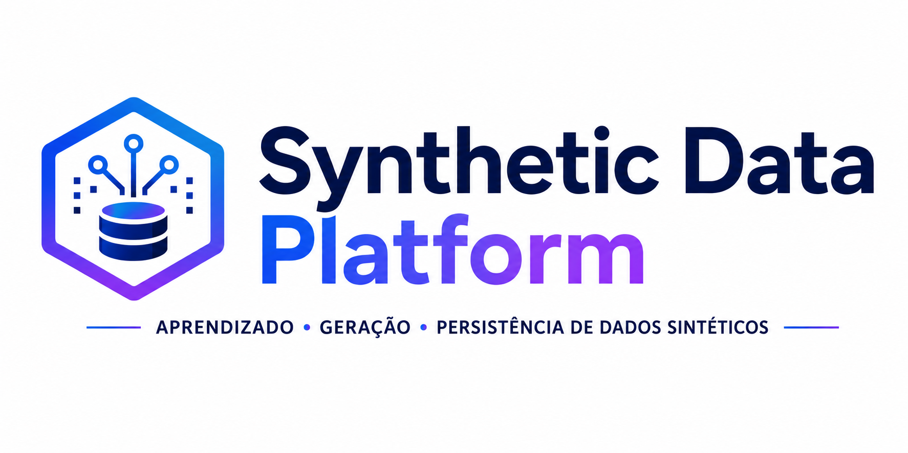

<p align="center">
  
</p>

# Synthetic Data Platform

Protótipo de um fluxo reproduzível para preparação, geração e avaliação de dados tabulares sintéticos com Python, Jupyter e [SDV](https://docs.sdv.dev/sdv). O projeto consolida partições de uma tabela de clientes, treina um sintetizador baseado em cópula gaussiana e persiste localmente os metadados e a amostra produzida.

> **Estado do projeto:** prova de conceito em desenvolvimento. A execução é manual, orientada por notebooks e limitada a uma única tabela (`customers`). Não se trata, neste estágio, de uma plataforma de produção ou de uma solução de anonimização certificada.

## Fluxo implementado

```text
data/raw/customers/*.csv
            │
            ▼
01_data_preparation.ipynb
  • valida o esquema das partições
  • consolida os registros
  • verifica ausências e IDs duplicados
            │
            ▼
data/processed/customers.csv
            │
            ▼
02_gaussian_copula.ipynb
  • detecta e ajusta metadados
  • treina o GaussianCopulaSynthesizer
  • gera e avalia uma amostra sintética
            │
            ▼
data/synthetic/customers_metadata.json
data/synthetic/customers_synthetic.csv
```

O fluxo cobre:

- ingestão de arquivo particionado em csv;
- consolidação e verificações exploratórias de qualidade;
- detecção e ajuste semântico dos metadados pelo SDV;
- treinamento e amostragem com `GaussianCopulaSynthesizer`;
- diagnóstico de validade e estrutura dos dados gerados;
- avaliação de distribuições por coluna e relações entre pares de colunas;
- persistência local dos metadados e do conjunto sintético.

## Tecnologias

- Python `>=3.10,<3.12`;
- Poetry 2 para dependências e ambiente virtual;
- pandas e PyArrow para processamento tabular;
- SDV para modelagem, geração e avaliação;
- Jupyter e Watermark para execução e registro do ambiente.

As versões resolvidas estão registradas em `poetry.lock`. O projeto utiliza `package-mode = false`, pois a implementação ainda reside nos notebooks e não é distribuída como pacote Python.

## Estrutura do repositório

```text
.
├── data/
│   ├── raw/                 # partições CSV de origem (não versionadas)
│   ├── processed/           # tabela consolidada (não versionada)
│   └── synthetic/           # metadados e amostras geradas (não versionados)
├── docs/
│   ├── adr/                 # registros de decisões arquiteturais
│   ├── images/              # recursos visuais da documentação
│   └── architecture.md      # arquitetura e limites da solução
├── notebooks/
│   ├── 01_data_preparation.ipynb
│   └── 02_gaussian_copula.ipynb
├── pyproject.toml
├── poetry.lock
└── README.md
```

Os diretórios de dados mantêm apenas arquivos `.gitkeep` no Git. Entradas e artefatos gerados são ignorados para evitar o versionamento acidental de dados potencialmente sensíveis.

## Como executar

### Pré-requisitos

- Python 3.10 ou 3.11;
- [Poetry](https://python-poetry.org/docs/#installation) 2.x;
- arquivos de entrada compatíveis com o contrato descrito abaixo.

### 1. Instale o ambiente

Na raiz do repositório:

```bash
poetry install -E notebooks
```

### 2. Prepare os dados de entrada

Crie o diretório de entrada e adicione uma ou mais partições CSV:

```bash
mkdir -p data/raw/customers
```

Os arquivos devem usar codificação UTF-8, possuir as mesmas colunas e respeitar o esquema esperado:

```text
firstname,lastname,email,address,country,last_country_logged,
creation_date,last_activity_date,age_group,id
```

O fluxo pressupõe ainda que:

- `id` identifica unicamente cada registro;
- `country` e `last_country_logged` contêm códigos de país ISO Alpha-2;
- as datas podem ser interpretadas no formato `%m-%d-%Y %H:%M:%S`;
- `age_group` é uma variável numérica;
- todas as partições apresentam as colunas na mesma ordem.

### 3. Inicie o Jupyter

```bash
poetry run jupyter lab
```

Execute integralmente os notebooks, nesta ordem:

1. `notebooks/01_data_preparation.ipynb`;
2. `notebooks/02_gaussian_copula.ipynb`.

Os notebooks aceitam execução iniciada na raiz do projeto ou no diretório `notebooks/`. Ao final, verifique:

```text
data/processed/customers.csv
data/synthetic/customers_metadata.json
data/synthetic/customers_synthetic.csv
```

## Avaliação dos resultados

O segundo notebook executa duas análises complementares do SDV:

- **diagnóstico**, que verifica validade dos valores e compatibilidade estrutural;
- **relatório de qualidade**, que compara distribuições individuais e tendências entre pares de colunas.

Também são exibidas comparações visuais para `age_group`. As pontuações devem ser analisadas a cada execução: uma estrutura válida não garante fidelidade estatística, utilidade analítica ou proteção contra reidentificação. O protótipo ainda não define limiares de aceite nem testes automatizados para essas propriedades.

## Privacidade e uso responsável

O notebook preserva deliberadamente a coluna `id` do conjunto de origem para manter compatibilidade com relacionamentos externos. Como consequência, o CSV gerado contém identificadores reais e **não deve ser considerado anônimo**.

Antes de utilizar a abordagem com dados sensíveis ou fora de um ambiente controlado, é necessário, no mínimo:

- substituir ou remover identificadores e quase-identificadores;
- estabelecer critérios mensuráveis de qualidade e privacidade;
- avaliar riscos de memorização, associação e reidentificação;
- aplicar controles de acesso, retenção e descarte;
- validar requisitos legais e de governança aplicáveis ao contexto.

## Limitações atuais

- fluxo específico para a tabela e o esquema de `customers`;
- execução manual e dependente do estado do kernel;
- ausência de CLI, API, orquestração e parametrização externa;
- lógica concentrada em notebooks, sem módulos reutilizáveis;
- ausência de testes automatizados e integração contínua;
- preservação da chave primária original;
- ausência de comparação entre diferentes sintetizadores;
- ausência de critérios formais de aprovação de qualidade e privacidade.

## Evolução planejada

- [ ] extrair preparação, treinamento e avaliação para módulos Python testáveis;
- [ ] parametrizar caminhos, esquema, modelo e volume de amostragem;
- [ ] adicionar testes de dados e execução automatizada do pipeline;
- [ ] definir métricas e limiares de qualidade e privacidade;
- [ ] remover ou pseudonimizar identificadores de origem;
- [ ] comparar Gaussian Copula com outros sintetizadores adequados ao caso;
- [ ] adicionar automação de qualidade e integração contínua.

## Gestão do projeto

O projeto foi organizado com **práticas ágeis em fluxo Kanban**, com **Jira** para acompanhamento das atividades e **GitHub para versionamento**, revisão histórica do código e documentação técnica. As práticas adotadas priorizam rastreabilidade, clareza das decisões e preparação para evoluções incrementais do fluxo.

- **Rastreabilidade:** branches, commits e pull requests foram associados às tarefas do Jira, permitindo relacionar mudanças no repositório ao histórico de execução do projeto.
- **Padronização:** a organização do repositório e os padrões de formatação foram definidos de forma compatível com uma evolução futura para automações de qualidade e CI/CD.
- **Decisões técnicas:** decisões arquiteturais relevantes foram registradas em ADRs, preservando contexto, motivação e consequências das escolhas adotadas.

## Documentação técnica

- [Arquitetura da solução](docs/architecture.md)
- [ADR-001 — Usar SDV](docs/adr/ADR-001-uso-sdv.md)
- [ADR-002 — Usar Poetry](docs/adr/ADR-002-uso-poetry.md)
- [ADR-003 — Usar Jupyter Notebooks](docs/adr/ADR-003-uso-jupyter-notebooks.md)
- [ADR-004 — Adotar ADRs individuais](docs/adr/ADR-004-adocao-de-adrs-individuais.md)

## Contribuições

Contribuições serão bem-vindas à medida que o projeto evoluir. Sugestões de melhoria incluem o refinamento dos notebooks, a definição de métricas de qualidade e privacidade, a automação do fluxo de geração de dados sintéticos, a ampliação dos testes e a comparação entre diferentes estratégias de síntese.

## Licença

Este projeto é distribuído sob a licença MIT. Consulte o arquivo `LICENSE` para mais informações.

## Autor

**Alexandre Rodrigues**

Data Science | Data Engineer | Analytics

---

Se este projeto foi útil para você, considere deixar uma ⭐ no repositório.
